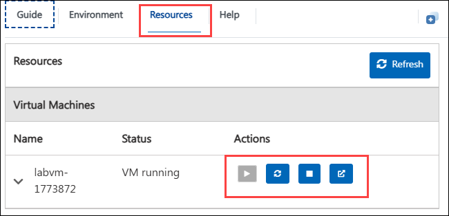

# Hands-On Lab - Build, Deploy, and Scale Power Apps

### Overall Estimated Duration: 8 Hours

## Overview

The hands-on lab workshop will begin by guiding you through how to build scalable and maintainable Power Apps using tools like **Copilot**, a well-defined **environment strategy**, and **solutions** for better reusability and structure. You will then move on to deploying your apps using **ALM best practices**, where you'll learn how to use **Pipelines** and the **ALM Accelerator** to manage deployments across development, test, and production environments. Finally, the lab will cover how to **scale your Power Apps** effectively by setting up **admin approvals** and using **Power Platform Advisor** to monitor and optimize your applications for better performance and governance.

## Getting Started with the Lab
 
Welcome to your Build, Deploy, and Scale Power Apps workshop! We've prepared a seamless environment for you to explore and learn about Azure services. Let's begin by making the most of this experience:

## Accessing Your Lab Environment
 
Once you're ready to dive in, your virtual machine and guide will be right at your fingertips within your web browser.
 

## Virtual Machine & Lab Guide
 
Your virtual machine is your workhorse throughout the workshop. The lab guide is your roadmap to success.
 
## Exploring Your Lab Resources
 
To get a better understanding of your lab resources and credentials, navigate to the **Environment** tab.
 

 
## Utilizing the Split Window Feature
 
For convenience, you can open the lab guide in a separate window by selecting the **Split Window** button from the Top right corner.
 

 
## Managing Your Virtual Machine
 
Feel free to start, stop, or restart your virtual machine as needed from the **Resources** tab. Your experience is in your hands!
 

## Lab Guide Zoom In/Zoom Out

To adjust the zoom level for the environment page, click the **A↕: 100%** icon located next to the timer in the lab environment.

## Support Contact
 
The CloudLabs support team is available 24/7, 365 days a year, via email and live chat to ensure seamless assistance at any time. We offer dedicated support channels tailored specifically for both learners and instructors, ensuring that all your needs are promptly and efficiently addressed.

Learner Support Contacts:
- Email Support: cloudlabs-support@spektrasystems.com
- Live Chat Support: https://cloudlabs.ai/labs-support

Now, click on **Next** from the lower right corner to move on to the next page.
 

### Happy Learning!!
