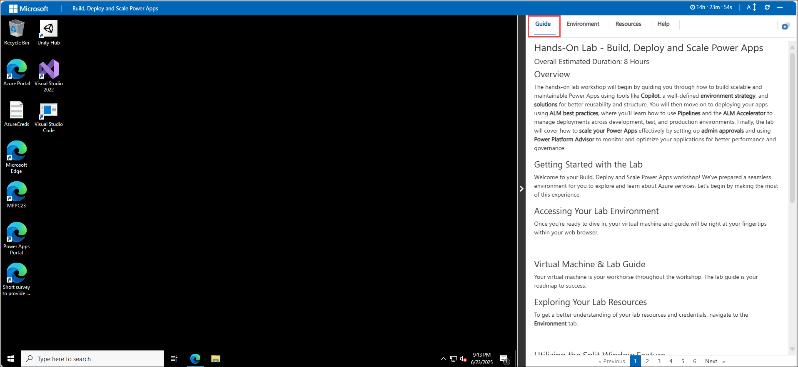
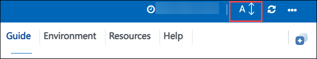
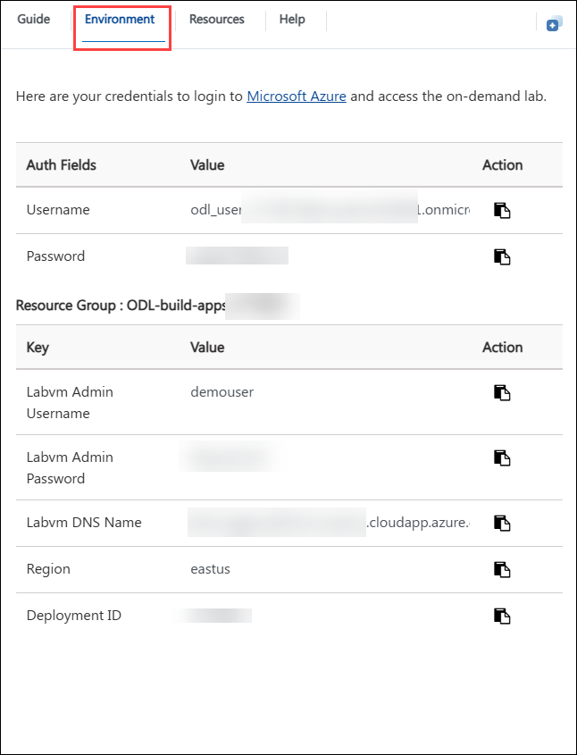
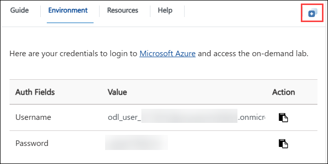
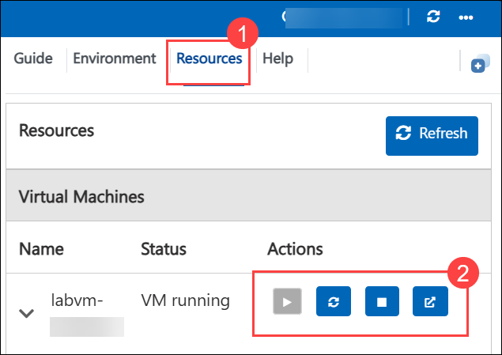

# Hands-On Lab - Build, Deploy, and Scale Power Apps

### Overall Estimated Duration: 8 Hours

## Overview

In this hands-on lab, you will learn how to build scalable and maintainable Power Apps by leveraging tools like Copilot, implementing a robust environment strategy, and organizing components using solutions for better reusability and structure. You'll begin by setting up your development environment using GitHub Codespaces and Power Platform CLI, creating environments, and enabling essential features like Managed Environments and Dataverse settings. As you progress, you'll develop canvas apps using Excel data and Copilot, then deploy them using Pipelines and the ALM Accelerator*, following ALM best practices across Dev, QA, and Prod. You'll extend deployment flows with approval gates for enterprise governance, and optionally connect a custom Web API to your Power App. Finally, you’ll explore how to monitor and optimize your apps using Power Platform Advisor, ensuring they are performant and well-governed at scale.

## Objectives

By the end of this lab, you will be able to:

- **Environment Setup and Power Platform Configuration**: In this hands-on lab, participants will set up their development environment by creating a GitHub account, configuring a GitHub Codespace, and connecting to the Power Platform using the CLI. They will create and manage environments, enable Managed Environments and Dataverse settings, and deploy the pipelines solution to support streamlined ALM and governance.

- **Building Canvas Apps with Power Apps and Copilot**: In this hands-on lab, participants will explore app development using Power Apps by creating canvas apps from both Excel data and with the help of Power Apps Copilot. They will also learn how to structure and manage their components by creating a solution and adding Copilot-generated resources to it for better organization and reusability.

- **Deploying Solutions with Pipelines**: In this hands-on lab, participants will learn how to automate application deployments using Power Platform Pipelines. They will create their first deployment pipeline and execute it to move solutions from the development environment to the QA environment, following ALM best practices.

- **Enterprise Scale – Scaling Deployments with Approval Gates**: In this hands-on lab, participants will enhance their deployment pipeline by introducing approval gates before pushing changes to the production environment. This exercise demonstrates how to apply enterprise-scale governance and control using the Deployment Pipeline Configuration App.

- **Connect your own WebAPI to your Power App**: In this optional hands-on lab, participants will learn how to extend Power Apps functionality by connecting a custom Web API. They will create an ASP.NET project in Visual Studio, register it as a connected service with Power Platform, and build a canvas app that interacts with the API using a custom connector.

## Prerequisites

- Experience with GitHub, including creating an account, forking repositories, and working with GitHub Codespaces.

- Basic understanding of Microsoft Power Platform components including Power Apps, Power Automate, and Dataverse.

- Familiarity with the Power Platform admin center and the concept of environments (Dev, QA, Prod).

- General knowledge of Application Lifecycle Management (ALM) principles, including solution packaging and deployment.

- General knowledge of environment management, data governance, and DLP (Data Loss Prevention) policies.

- Basic experience with Visual Studio and C#, including creating and running ASP.NET Web API projects.

## Getting Started with the Lab
 
Welcome to your Build, Deploy, and Scale Power Apps workshop! We've prepared a seamless environment for you to explore and learn about Azure services. Let's begin by making the most of this experience:

### Accessing Your Lab Environment
 
Once you're ready to dive in, your virtual machine and **Guide** will be right at your fingertips within your web browser.
 

### Lab Guide Zoom In/Zoom Out

To adjust the zoom level for the environment page, click the **A↕: 100%** icon located next to the timer in the lab environment.

## Virtual Machine & Lab Guide
 
Your virtual machine is your workhorse throughout the workshop. The lab guide is your roadmap to success.
 
### Exploring Your Lab Resources
 
To get a better understanding of your lab resources and credentials, navigate to the **Environment** tab.
 

 
### Utilizing the Split Window Feature
 
For convenience, you can open the lab guide in a separate window by selecting the **Split Window** button from the Top right corner.
 

 
### Managing Your Virtual Machine
 
Feel free to **start, stop, or restart (2)** your virtual machine as needed from the **Resources (1)** tab. Your experience is in your hands!
 

## Support Contact
 
The CloudLabs support team is available 24/7, 365 days a year, via email and live chat to ensure seamless assistance at any time. We offer dedicated support channels tailored specifically for both learners and instructors, ensuring that all your needs are promptly and efficiently addressed.

Learner Support Contacts:
- Email Support: cloudlabs-support@spektrasystems.com
- Live Chat Support: https://cloudlabs.ai/labs-support

Now, click on **Next** from the lower right corner to move on to the next page.
 

### Happy Learning!!
