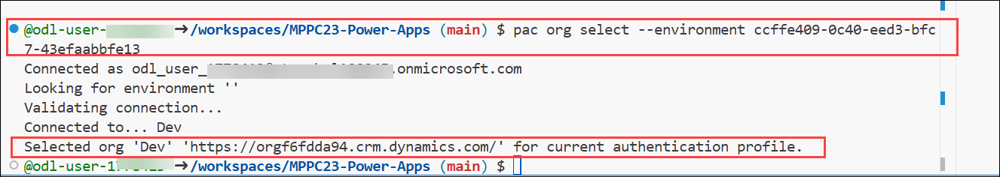

# 🚀 Lab 1: Environment Setup and Power Platform Configuration

### Estimated Duration: 120 mins

## Lab Scenario

You are a Power Platform developer at Contoso Ltd, responsible for setting up a secure and scalable development environment to support application lifecycle management (ALM) across multiple environments. In this lab, you will create and configure your GitHub repository, set up a Codespace for development, and use the Power Platform CLI to provision and manage environments. You'll enable Managed Environments, deploy the pipelines solution to your production environment, and configure key Dataverse settings—all foundational steps to support efficient and governed app development and deployment workflows.

## Lab Objectives

In this lab, you will go through the following tasks:

- Task 1: Log in to your account
- Task 2: Create a GitHub account
- Task 3: Create a fork of the repository for this workshop
- Task 4: Creating a GitHub Codespace
- Task 5: Connect to the Power Platform using the Power Platform Command-Line Interface (CLI)
- Task 6: Create developer environments
- Task 7: Switch between environments with the Power Platform CLI
- Task 8: Enable Managed Environments on all environments
- Task 9: Deploy the pipelines solution to your Prod environment
- Task 10: Enable Dataverse settings

## Task 1: Log in to your account

In this task, you will sign in to the Power Platform using the provided credentials to access the tools and services needed for the lab. Let's log into the account you will use during the workshop.

1. Open **Microsoft Edge** browser and navigate to **[make.powerapps.com](https://make.powerapps.com)**
1. On the sign-in screen, enter the email below and click **Next**,
 
   - **Email/Username:** <inject key="AzureAdUserEmail"></inject>

     

1. Next, provide your password to log in:
 
   - **Password:** <inject key="AzureAdUserPassword"></inject>

     

1. If you're prompted to stay signed in, click **No**

    You should now be logged in and on the Power Apps Home Page.

    

## Task 2: Create a GitHub account

In this task, you will create a GitHub account using the provided credentials. This account will be used throughout the workshop for code management, collaboration, and deployment activities.

1. Open a new tab on **Microsoft Edge** browser and go to  [GitHub](https://github.com) website.

1. Click on **Sign up** on the top right corner

    

    - Enter your **Email:** **<inject key="AzureAdUserEmail"></inject>** **(1)**

    - Create a **Password:** <inject key="AzureAdUserPassword"></inject> **(2)**

    - Enter a **username:** **odl-user-<inject key="DeploymentID" enableCopy="false"/>** **(3)**

    - Uncheck **Receive occasional product updates and announcements** **(4)** and then click **Continue** **(5)**
        
      

    -  Click on the **Visual puzzle** 
        
       

     - Solve the puzzle to verify your account, and then click **Continue**  
            
1. Go to [Outlook for the web](https://outlook.office.com) in a new tab and sign in with the credentials below,
    - **Email/Username:** <inject key="AzureAdUserEmail"></inject>
    
    - **Password:** <inject key="AzureAdUserPassword"></inject>

    - Under **Inbox** open the **Email** that was sent to you from GitHub and **Copy** the code.

        

1. Enter the code that was sent to your email address on the GitHub website and click **Continue** to confirm the email address. This should lead you to the sign-in page.
    
    - Enter the **Email/Username:** <inject key="AzureAdUserEmail"></inject> **(1)** and **Password:**  <inject key="AzureAdUserPassword"></inject> **(2)** and click on **Sign in** **(3)**

        

You now have a GitHub account. Welcome to the GitHub community!

## Task 3: Create a fork of the repository for this workshop

In this task, you will create a fork of the workshop repository, allowing you to work on your own copy without affecting the original project. This forked repository will be used for development throughout the lab.

1. Open a new tab on **Microsoft Edge** browser, **Copy and Paste** the link  [MPPC23-Power-Apps](https://aka.ms/MPPC23-Power-Apps) to go to the GitHub repository.

1. Click on the **Fork** button in the top right corner

    

1. Once the "Create a new fork" page opens, review the information and then click **Create Fork**

    

1. Once you have created the fork, you will be redirected to your forked repository. You can see that you are in your forked repository by looking at the top left corner of the page. It should say **MPPC23-Power-Apps forked from microsoft/MPPC23-Power-Apps**.

    

## Task 4: Create a GitHub Codespace

In this task, you will create a GitHub Codespace from your forked repository. This cloud-based development environment will allow you to build and manage Power Platform components directly from your browser using Visual Studio Code.

1. Make sure that you are in your forked repository **odl-user-<inject key="DeploymentID" enableCopy="false"/> / MPPC23-Power-Apps** and then find and click on the **<> Code** **(1)** button.

    - On the **Code** pop up, select the **Codespaces** **(2)** tab.

    - Click **Create codespace on main** **(3)**.

      

1. A codespace will now be created for you in a new tab. This will take a few seconds. But once it's done, you will have a fully functional **Visual Studio Code** environment in your browser. You can now start developing!.

    

## Task 5: Connect to the Power Platform using the Power Platform Command-Line Interface (CLI)

In this task, you will connect your GitHub Codespace to the Power Platform using the Power Platform CLI. This will authenticate your environment and allow you to manage environments, solutions, and deployments directly from the terminal.

1. In your codespace, you will see a pop-up for **Power Platform Tools** Extension,  click on **Allow**.

    

1. If prompted, select the your user account **<inject key="AzureAdUserEmail"></inject>**.

    

1. In your codespace, click on the **Power Platform** icon on the left navigation pane.

    

1. You'll more than likely see that there is **No auth profiles found on this computer**. Let's create one.

    

1. If you don't see it open already, let's open the Terminal. Click on the **Burger menu icon** **(1)** in the top left corner and then hover over **Terminal** **(2)** and then click **New Terminal** **(3)**

    

    A terminal window has now been opened for you. This is where you will write all of the following commands in this lab and in the upcoming labs as well.

1. Type the following command in the terminal and then press **Enter**:

    ```bash
    pac auth create --deviceCode
    ```

1. You will be prompted to use a web browser to authenticate. Copy (**ctrl + c**) the ```code``` **(1)** that is provided in the terminal and then **Ctrl + click** on the ```link``` **(2)** that is provided in the terminal.
    
    > **Note:** If you are using a Mac, you can **Command (⌘) + click** on the ```link``` that is provided in the terminal and then enter the ``code`` provided.
    
    

    - Once you click on that link, it will open a new browser tab where you will have to **Paste** that code into the browser **(1)** and then click **Next (2)**

        

1. Choose the lab user **Email/Username:** <inject key="AzureAdUserEmail"></inject>.
    
    > Note: If you can't see it on screen, then log in.

    

1. Then type in your password and click **Sign in**

1. You will see a Pop-up **Are you trying to sign in to Power Platform CLI - pac**. Click **Continue**

    

    > **Note:** You'll then see a prompt confirming that you have successfully signed in to Power Platform CLI - pac. Close the browser tab and return to your codespace.

    

1. If you don't see any **Auth Profiles**, refresh the Auth Profiles section by clicking on the **Refresh** button next to "Auth Profiles".

    

    > **Note:** You should now see at least one auth profile. If you have more than one, you can select the one you want to use by clicking on the **Select Auth Profile** button next to the auth profile.

    

## Task 6: Create developer environments

Developer environments are very helpful when you want to try out features; they are meant to be short-lived environments.

For this workshop, we are going to create three different developer environments:

- ```Dev```: The environment where we are going to create our app and solution later on.
- ```QA```: The environment where we are going to deploy our solution in a later lab.
- ```Prod```: The environment where we are going to deploy our solution in a later lab.

To create developer environments, you can create them in multiple ways:

1. By subscribing to the Power Apps Developer Plan
1. Via the Power Platform Admin Center (PPAC)
1. Via the Power Platform CLI

   > **Note:**
   > When subscribing to the developer plan, you will automatically be assigned a developer license to yourself. When creating a developer environment through PPAC or the CLI, you will not do that. That's why we do this step first, so that you won't have to start a trial.

In this workshop, we will create one environment through the UI, one via PPAC, and the last one via the CLI, so that you know all about how to create developer environments.

### Task 6.1 Create the 'Dev` environment by subscribing to the developer plan

In this task, you will subscribe to the Power Apps Developer Plan to create your own personal development environment. This environment will be renamed to Dev and used for app development and testing throughout the lab.

1. Open **Microsoft Edge** browser and navigate to the [Power Apps Developer Plan](https://aka.ms/pp/devplan) website
1. Scroll down and select **Try for free** under **Developer plan**.

    

1. Enter the **Email/Username:** <inject key="AzureAdUserEmail"></inject> **(1)**, select the **Check box** **(2)** to agree to terms, and click on **Start Free** **(3)**.

    

1. If required, enter the **Password:** <inject key="AzureAdUserPassword"></inject> and click on **Sign in**.

    

1. Click on **No** on the Stay signed in pop-up.

    

1. A Power Platform developer environment will be created for you with the name `{User}'s Environment`, and you will be redirected to the maker portal. Here, review the details below
    -  The **Environment** at the top-right for your recently created environment **ODL_User <inject key="DeploymentID"></inject>'s Environment** **(1)** selected and prompt stating **This is a developer environment and not meant for production use** **(2)**

        

1. In the new tab, go to the [Power Platform Admin Center](https://aka.ms/ppac)

1. Close the Welcome pop-up.

1. Select **Manage** **(1)** in the left navigation, **Environments** **(2)**, and then Select the **ODL_User <inject key="DeploymentID"></inject>'s Environment** **(3)** 

    

1. In the details card, select **edit**

    

1. In the side panel, change the **Name** **(1)** to `Dev` and select the **Save** **(2)** button.

    


### Task 6.2 Create a new **QA** environment via the Power Platform Admin Center (PPAC).

In this task, you will create a new QA environment using the Power Platform Admin Center. This environment will be used to test your applications and solutions as part of the ALM process.

1. Select **Environments (2)** under **Manage (1)** and then select **+ New (3)** in the top navigation pane.

    

1. When the right-hand side dialog pops up - enter the following information and then click on **Next (5)**.

    | Field | Value |
    | --- | --- |
    | Name | **QA** **(1)**| 
    | Region | **US - Default** **(2)** |
    | Type | **Developer** **(3)** |
    | Purpose | **Developer environment for MPPC23** **(4)** |

    

1. Leave everything to default and click on **Save**

    

### Task 6.3 Create a **Prod** environment via the Power Platform Command-Line Interface (CLI)

In this task, you will create a Prod environment using the Power Platform CLI directly from your Codespace terminal. This approach offers a faster and more efficient way to provision environments without using the admin UI.

1. Navigate to the CodeSpace. If you see a pop-up **CodeSpace is Stopped**, click on **Restart CodeSpace**.

    

    > Note: We will create the last environment with the following values:

    | Field | Value |
    | --- | --- |
    | Name | **Prod** |
    | Region | **US - Default** |
    | Type | **Developer** |

1. Run the following command in the terminal in your codespace:

    ```bash
    pac admin create --name "Prod" --type "Developer"
    ```

         

      >**Note:** We won't be using `purpose` here, because the Power Platform CLI doesn't have a parameter for this. Also, we are using the defaults for `region` and `currency`, so we don't have to add those to the command.

1. Once you have created all three environments, you should see them in the list of environments. Click the **Refresh** button on the top navigation if you don't see them yet.

    

## Task 7: Switch between environments with the Power Platform CLI

In this task, you will use the Power Platform CLI to view available environments and switch the active context to the Dev environment. This allows you to run CLI commands against the correct environment throughout the lab.

1. In the terminal, type the following command and then press **Enter**:

    ```bash
    pac org list
    ```

    This gets a list of all the environments that you have access to. You should see the **Dev** environment listed as one of them. This is the one we want to eventually connect to.

    > **Note:** It can take a couple of minutes before you get the full list of environments. Run the command again every minute until you see all the environments.    

    

1. Copy the **Environment ID** of the **Dev** Environment and paste it into Notepad.

    

1. Then in the terminal, type the following command and then press **Enter**. Make sure to replace ```00000000-0000-0000-0000-000000000000``` with the **Environment id** that you copied above.

    ```bash
    pac org select --environment <00000000-0000-0000-0000-000000000000>
    ```

    - You should then see confirmation that you have successfully selected the **Dev** org for the current auth profile.

      

1. To have further confirmation that you have successfully connected to the **Dev** environment, in the terminal type the following command and then press **Enter**:

    ```bash
    pac org who
    ```

    This command will return information about the environment that you are connected to. You should see the **Dev** environment listed as well as other unique information about the environment, including the User email you're connected as.

    

## Task 8: Enable Managed Environments on all environments

In this task, you will enable Managed Environments for all three environments—Dev, QA, and Prod. This feature helps apply governance, monitoring, and security policies across environments in an enterprise-grade setup.

1. Go back to the [Power Platform Admin Center](https://aka.ms/ppac) tab.

1. Select **Environments (2)** under **Manage (1)** in the left navigation pane.

    - Select **Dev (3)** and click on **Enable Managed Environments (4)** button at the top.

      

1. Make sure you review the **Licensing details** **(1)**. Leave everything else as default and click on **Enable** **(2)**.

    

1. **Repeat steps 3-5** for both the `QA` and `Prod` environments.

1. Once enabled for the other two environments, you should see **Yes** in the **Managed** column for all three environments.

    

## Task 9: Deploy the pipelines solution to your Prod environment

In this task, you will learn how to install the pipelines for the Power Platform solution in your `Prod` environment.

There are two ways to install the Pipelines solution:

### Task 9.1 Via Power Platform Admin Center

In this task, you will install the Power Platform Pipelines app in the Prod environment using the Power Platform Admin Center. This app enables deployment automation and is a core component for implementing ALM in your Power Platform environments.


1. Go to the [Power Platform Admin Center](https://aka.ms/ppac).

1. Navigate to the **Prod** environment you created before.

    

1. At the top , select **Resources** **(1)** and **Dynamics 365 apps** **(2)**.

    

1. Here you can find the apps that are installed on your `Prod` environment by default. Select the **Install App** button in the command bar at the top

    

1. In the sidebar that opens, scroll down, select the **Power Platform Pipelines** **(1)** app, and select the **Next** **(2)** button at the bottom of the sidebar

    

1. Next,select **I agree to the termsof service** **(1)** and select the **Install** **(2)** button at the bottom of the sidebar

    

1. This process will take around `20-25 minutes`. You can refresh the page by selecting the **Refresh** button in the command bar at the top.

1. Meanwhile you can proceed with the next task. After **20-25 minutes** you can come back and perform the below steps:

    - When finished, you can go to the [maker portal](https://make.powerapps.com).
    
    - Select the **Environment (1)** from the top right and then select `Prod` **(2)** environment.

          
    
    - Navigate to **Apps (1)**, then **All (2)** if all went well, you should be able to see the `Deployment Pipeline Configuration` **(3)** app in the Apps section in the maker portal.

           

### Task 9.2 Via Power Platform CLI

In this task, you will install the Power Platform Pipelines application in the Prod environment using the Power Platform CLI. This method provides a quick, scriptable way to deploy solutions without navigating through the admin UI.

1. Open up your Codespace.

1. Open a new terminal by selecting the **Hamburger Menu (1) > Terminal (2) > New Terminal (3)**.

    

1. Open the Power Platform Tools VS Code Extension by selecting the **Power Platform DevTools (1)** icon on the left, make sure you see the `Prod` **(2)** environment in the Environments & Solutions panel and select the **empty star (3)** behind it to select the right environment.

    

1. Enter the following command:

    ```bash
    pac application list
    ```

    This command will return all the applications that you can install with the `pac application install` command.

    Highlighted is the unique name of the `Power Platform Pipelines` application: `msdyn_AppDeploymentAnchor`.

    

1. Now we can install the `Power Platform Pipelines` application by using the following command:

    ```bash
    pac application install --application-name msdyn_AppDeploymentAnchor
    ```

    >**Note**: You may get an message like `Power Platform Pipelines` application is already installed, please proceed with the next task.

## Task 10: Enable Dataverse settings

A recent addition to the Power Platform CLI is the ability to list and update Dataverse settings. This means that you can change the settings that are normally only available through the UI. In this task, you will learn how to change the settings.

### Task 10.1 List Dataverse settings

In this task, you will list and filter Dataverse settings in the Dev environment using the Power Platform CLI. This helps you inspect key configuration options, such as audit settings, to better understand and manage environment behavior.

1. Ensure you run the command below to switch to the `Dev` environment. Since you selected **Prod** in the previous task, the current environment is still set to **Prod**.

    ```bash
    pac org who
    ```

    

1. So make sure to switch the environment to `Dev` by following the below steps.

1. In the terminal, type the following command and then press **Enter**. Make sure to replace ```00000000-0000-0000-0000-000000000000``` with the **Environment id** that you copied in `Task 7 Step 2`.

    ```bash
    pac org select --environment <00000000-0000-0000-0000-000000000000>
    ```

    - You should then see confirmation that you have successfully selected the **Dev** org for the current auth profile.

      

1. Run the following command and then press **Enter**:

    ```bash
    pac org list-settings
    ```

    This command will return all the settings in the org we are connected to now (the `Dev` environment). This is a very large list. We can filter through the list.

1. Add the `--filter` parameter and filter for all settings that contain `audit` with the following command:

    ```bash
    pac org list-settings --filter audit
    ```

    This command will return all the settings that contain `audit` in the org we are connected to now (the `Dev` environment). As you can see, this is a way smaller list than what we saw before.

    

### Task 10.2 Update Dataverse settings

In this task, you will update a Dataverse setting using the Power Platform CLI by enabling auditing in the Dev environment. This demonstrates how to programmatically manage environment configurations for enhanced governance.

1. Let's try out how updating a setting works. In the list of audit settings, we just saw a **`isauditenabled`** setting which is set to **No**.

   

1. Run the following command and then select **Enter**:

    ```bash
    pac org update-settings --name isauditenabled --value true
    ```

         

      This command will set the `isauditenabled` setting to true.

      > **Note:** Note that the list command showed `No` as the output, but to update we need to use true or false.

1. Run the following command again to verify if the setting is applied and select **Enter**:

    ```bash
    pac org list-settings --filter audit
    ```

    

    >**Note**: This command will return all the settings that contain `audit` in the org we are connected to now (the `Dev` environment). As you can see, the `isauditenabled` setting is now set to `No`.    

## Review

In this lab you have completed the following tasks:

- Task 1: Logged in to your account
- Task 2: Created a GitHub account
- Task 3: Created a fork of the repository for this workshop
- Task 4: Created a GitHub Codespace
- Task 5: Connected to the Power Platform using the Power Platform Command-Line Interface (CLI)
- Task 6: Created developer environments
- Task 7: Switched between environments with the Power Platform CLI
- Task 8: Enabled Managed Environments on all environments
- Task 9: Deployed the pipelines solution to your Prod environment
- Task 10: Enabled Dataverse settings

### Congratulations! you have successfully completed this lab, please click on **Next** to continue with the next lab
