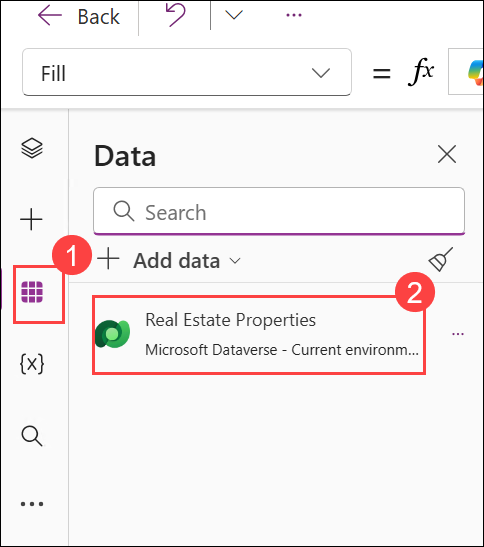

# 🚀 Lab 2: Building Canvas Apps with Power Apps and Copilot

### Estimated Duration: 90 minutes

## Lab Scenario

You are a low-code developer at Contoso Ltd tasked with rapidly building user-friendly business applications. In this lab, you'll explore how to create canvas apps using data from Excel and enhance productivity with Power Apps Copilot. You’ll also learn how to package your components into a solution for better structure, reusability, and lifecycle management—all using modern AI-assisted capabilities within the Power Platform.

### Lab Objectives

In this lab, you will go though the following tasks:

- Task 1: Creating A Canvas App With Data From An Excel-File
- Task 2: Creating A Canvas App With Power Apps Copilot
- Task 3 : Creating A Solution
- Task 4: Add The Resources Created By Power Apps Copilot To A Solution

## ☑️ Task 1: Create A Canvas App With Data From An Excel-File

In this task, you will use the Excel to App functionality in Power Apps to quickly generate a canvas app from an Excel file. This feature allows you to import structured Excel data into a Dataverse table and automatically build an app with screens for browsing, viewing, and editing records. You’ll then customize the gallery layout, add formatting, and publish the app for use within your environment.

#### Introduction To Excel To App

With Excel to App, you can quickly turn an Excel file into a functional canvas app that includes screens for browsing, viewing, creating, and editing records. Uploading the Excel file automatically creates a Dataverse table, allowing you to securely store data in the cloud using standard or custom tables tailored to your business needs. When using an environment in the US region with AI features enabled, Power Apps Copilot enhances the table creation process by suggesting names, descriptions, column types, and headers—even if the uploaded file lacks structure. This AI-assisted experience streamlines app development and data modeling. A Copilot card is displayed on tables generated using this feature, indicating Copilot’s involvement in the process.

> **Note:** Power Apps requires either a Microsoft 365 license or a free trial. Learn more about your licensing options. [Microsoft products include Microsoft Power Apps and Power Automate](https://learn.microsoft.com/power-platform/admin/pricing-billing-skus).

1. Navigate to the [make.powerapps.com](https://make.powerapps.com/) and sign In with your credentials if required.

1. From the Power Apps home screen, make sure to select **Dev (1)** environment, then go to **Apps** **(2)** and select **Start with data** **(3)**.

    

1. Then click on **Create new tables**.

    

1. Then click on **Import an Excel file or .CSV**.
    
    

1. Click **Select from device**.

    

1. Navigate to the location **`C:\LabFiles`** **(1)**, select the **RealEstateProperties.xlsx** **(2)** Excel file and click on **Open** **(3)**. The maximum file size limit is 5 GB.

    

1. Now click on **Import**.
   
    

1. Now, click on the **Elipses (1)** and then click on **Properties (2)**.

    

1. On the **Edit Table** pop up,

    - Display name: Enter **Real Estate Property** **(1)**
    - Plural Name: Enter **Real Estate Properties** **(2)**
    - Make sure Primary column is **Address** **(3)**
    - Select **Save** **(4)**

      

1. Select the **Save and open app** button on the top right-hand corner of the screen. 

    

1. If a pop up comes up click on **Save and open app** again.    

1. When the app first loads, a dialog may appear saying: **Welcome to Power Apps Studio**. If so, select the **Skip** button.

1. You should now be viewing the app that has been generated for you in Edit mode.

    

1. On the Left navigation pane, select the **Data icon (1)**. Notice that a Dataverse table, based on the **RealEstateProperties.xlsx (2)** Excel file, has been created.

    

1. Select the **Tree view icon** to return to the Tree view.

    

1. Under Tree View, click on **Real Estate Properties screen** **(1)** drop down, then click on **ScreenContainer1** **(2)** drop down, then click on **BodyContainer1** **(3)** drop down, then click on **SidebarContainer1 (4)** and then expnad **RecordsGallary1** **(5)**.

    

1. Right click on the **NextArrow1 (1)** of RecordsGallery and click on **Delete (2)**.

    

1. Select the **RecordsGallery1** **(1)** and then select the **edit button** **(2)** to put the gallery in edit mode.

    

1. Drag the **Title component** so that it's position is towards the right-hand side of the template cell.

    

     >**Note:** The other components should reposition alongside the Title component. If not, then move them until it looks like the screenshot above.

1. Make sure that the gallery is still in edit mode. Select the **Title (1)**.

    - Make sure that the Text value of the Title component is set to the following formula:

      `ThisItem.Address` **(2)**

      

1. Now select the **Subtitle component** **(1)** in the gallery.

    - Set the Text value suffix of the Subtitle to the following formula:

        **`ThisItem.Size`** **(2)**

    - Using the tool bar at the top of the page, change the Size to **13** **(3)**.

      

1. Finally, select the **Body** component in the gallery **(1)**.

    - Make sure the Text value of the Body is set to the following formula:

      **`ThisItem.Price` (2)**

            

1. Your gallery should now look like this:

    

1. Make sure the **RecordsGallery1** is still in edit mode. Then click on **Insert** **(1)**, then  search for **Image** **(2)**, and then select the **Image** **(3)** component.

    

1. The image will then be added to your gallery. Reposition and resize the image so that it is in the center of each gallery cell.

    

1. Make sure the gallery is still in edit mode. And select the gallery **Body** **(1)** containing the Price,

    - Change the Text value to **Text(ThisItem.Price, "$#,##0", "en-US")** **(2)** next to the Copilot icon. The body value will change as displayed in the screenshot below.

      

1. Select the **Subtitle** **(1)** of the gallery, 

    - Change the Text value to **"Size: " & Text(ThisItem.Size, "#,##0", "en-GB") & " sq ft"** **(2)** next to the Copilot icon. The body value will change as displayed in the screenshot below.

      

1. Click on **Save**.

    

1. Provide **App (1)** for App name and then click on **Save**.

    

1. Then click on **Publish** on the top right corner.

    

1. Leave everything as default and click on the **Publish this version** button. 

        

1. Wait for the app to Publish successfully.

    

1. Click on **<- Back** to exit the app to return to the Power Apps home page. 

    

1. Click on **Leave** if you see a pop-up.

1. Select **Cancel** to get back to the Power Apps home page.

    

## ☑️ Task 2: Create a Canvas App with Power Apps Copilot

In this task, you’ll create an application leveraging Power Apps Copilot.  This app will be used by field agents to browse real estate inventory and manage appointments for showings and the data will be stored in Dataverse.

> **Note:** Power Apps requires either a Microsoft 365 license or a free trial. Learn more about your licensing options. [Microsoft products include Microsoft Power Apps and Power Automate](https://learn.microsoft.com/power-apps/administrator/pricing-billing-skus/).

### Task 2.1 Explore AI Copilot within Power Apps

> **Note:** Within this lab, notice that your results for data may vary from those within the screenshots and images throughout the lab. This is because Power Apps is using OpenAI to generate data for the lab that changes daily.

1. Make sure you are in the **Dev environment** in the Power Apps Maker Portal.
   
1. From the left-hand navigation, click on **Apps (1)**, then select **Start with Copilot (2)**.
    
    

1. In the **Get started with Copilot** text field, enter the following **prompt (1)**:

    `build an app to manage real estate showings`

    - Click on the **filter icon (2)**, select **Small (3)** then select **one table (4)**, and then click on the **Generate (5)** button.

      

1. Once AI Copilot generates a table based on your prompt, review the table to see the columns that have been created as a starting point.

1. To view the sample data added by Copilot, click on the **three ellipses (⋯) (1)** next to the table and select **View data (2)**.
   
    

1. You can view the table with the following columns:

    - `Property Address`
    - `Showing date`
    - `Agent name`
    - `Client name`

1. In the text box, at the bottom of the **Copilot** pane to the right of the screen, type the following prompt **(1)** and then click on **Send**.

    **`add a column for client full name in Real Estate Showing table`** **(1)**

    - You'll see that Copilot has provided feedback that the table has been updated and you should also see the new column **Client Full Name** **(2)** added to the table:

      

1. Now type the following into the chat **(1)** and then select the **Send** button.

    **`add a column for client email to Real Estate Showing table` (1)**

    - New column has been added to the table displaying the **Client Email (2)**

      

       >**Note**: Please ensure the column is named **Client Email**. If it is not, provide a prompt to explicitly set the column name to `Client Email`

       >**Note** Remember that the data that is generated in your table may vary from the data shown within the table in the screenshots and images for the lab.

1. Now, let’s add a **Status** column within the  Real Estate Showing table. In the text box within the **Copilot** pane, type and **Send**:

    `add a column for Appointment Status to the Real Estate Showing table`

1. It may take a minute to load. Once it does, you'll see that the **Appointment Status** column has been updated to include the option for **Completed**.

1. Select the **Appointmnet Status (1)** column name **drop down**, and select **Edit column (2)**.

    

1. Make sure the data type is set to **Choice (1)**. Here, you can click on **+New choice (2)** and add the drop down options such as **Pending** and **Confirmed** if not already present, and then click on **Update (3)**.

    

    > **Note**: `the status choices should be Pending, Confirmed, Scheduled, Cancelled, and Completed`

1. Select the **X** in the top right corner of the pane to close out.

1. Let's try adding more data to our table and the existing columns.

1. Within the **Copilot** pane text box, type and send:

    `add 5 more rows of data`

    Notice that five more rows of data are added for each of the existing columns within the table.

    

    The list of columns that we will need going forward are:

    - `Property Address`
    - `Showing date`
    - `Agent name`
    - `Client name`
    - `Appointment Status`    
    - `Client Full Name`
    - `Client Email`    

    Use what you've just learnt with the **Copilot Chat** window to adjust your table to match the above. Don't forget to reference the Suggestions section for help in case you need to remove a column, change a column name, or add a column.

1. Let's create the app now. In the top right corner of the screen, select the **Save and open app** button.

    

1. Select the **Save and open app** button again.

    

1. When the app first loads, a dialog may appear saying: **Welcome to Power Apps Studio**. If so, select the **Skip** button.

    You should now be viewing the app, that has been built for you, in **Edit** mode:

    

1. To the left of the screen, select the **Data (1)** icon from the navigation bar. Notice that a **Dataverse** table has been created by the Copilot and is now in the **Environments** section **(2)**.

    

     >**Note:** Copilot is currently only supported for Dataverse. You cannot use any other data access point at this time.

1. We have to modify the gallery in the application so that it displays the relevant data. Select the **Tree view (1)** icon to return to the Tree view.

    - On the app main screen, click on **RecordsGallery1 (2)** displaying the **Real Estate Showings** and then select the **edit (3)** button to put the gallery in edit mode.

          

1. Select the **Title** and make sure  **Text** value is set to the following formula:

    `ThisItem.'Property Address'`

1. Select the **Subtitle (1)** and set the **Text** value to the following formula **(2)**:

    `ThisItem.'Client Email'`

       

1. Select the **Body (1)** and set the **Text** value to the following formula **(2)**:

    `ThisItem.'Appointment Status'`

         

1. A single record in the gallery should now look like this:

    

1. Now, let's make a new request for a property showing within the app.

1. From the top of the screen, select the **Play** button.

    

1. Within the pane to the left of the app, select the **+New** button.

    

1. Although you could modify the form to autofill the fields for you, we're going to do so ourselves to show that the app works.

1. Fill in the following fields with the information below:

    - Property Address: `210 Pine Road, Portland, OR 97204` **(1)**
    - Agent Name: < Your name > **(2)**
    - Client Full Name: < Your name > **(3)**
    - Appointment Status: `Pending` **(4)**    
    - Showing Date: < Any future date > **(5)**    
    - Time: < Any future time > **(6)**
    - Client Name: < Your name > **(7)**
    - Client Email: < Your email > **(8)**

    > **Note**: This address is one of the addresses from the Excel file in Module 1. The same file which we uploaded and turned into the **Real Estate Properties** table.

1. Then select the checkmark in the top right corner of the screen **(9)**.

    

1. Now, select the **X** in the top right corner to close out of the app.

    If a dialog appears saying: **Did you know?**, select **OK**.

1. Notice that the new request has been added to the list of requests to the left of the app.

    

1. From the top of your screen, select the **Save** button to save the new app you have created.

    

1. If asked, save app name as **Real Estate Showings (1)** and then **Save (2)**.

    

1. Select the **Publish** icon to publish the app

    

1. Generate a description using AI by selecting the **Create description using AI** button

    

1. Check if the description is correct. If not, correct it and select the **Publish this version** button. If yes, select the **Publish this version** button.

    

     >**Note:** The description may vary as we are generating using Copilot.    
    
1. Exit the app to return to the Power Apps home page.

Congratulations! You have now created a Power Apps Canvas App with Copilot!

## ☑️ Task 3: Create a solution

In this task, you will create a solution for the components we just created via Copilot!

1. Navigate to the [make.powerapps.com](https://make.powerapps.com/) and Sign in with your Power Apps credentials.

1. From the **Power Apps** home screen, select **Solutions** in the left navigation.

    

1. Select **+ New solution** at the top of the screen.

    

1. Add the solution name `MPPC 23` **(1)** and select **+ New publisher (2)**.

    

1. Add the details below

    - Display name: **Microsoft Power Platform Conference** **(1)**,
    - Name: **MicrosoftPowerPlatformConference** **(2)**, and 
    - Prefix: **mppc** **(3)**. 
    - Select **Save** **(4)** when you're done.

      

1. The newly created publisher will be automatically selected in the **Publisher** dropdown **(1)**. Leave other settings as default and Select the **Create (2)** button at the bottom.

    

     > **Notes:** This concludes task 3, you have created the `MPPC 23` solution.

## ☑️ Task 4: Add the resources created by Power Apps Copilot to a solution

In this task, you will add the components we just created via Copilot to the `MPPC 23` solution!

1. Select **Add existing** **(1)** > **App** **(2)** > **Canvas app** **(3)**

    

1. In the next screen select all apps by clicking the checkbox besides **Display Name** **(1)** and select the **Add** **(2)** button at the bottom.

    

    This will add the canvas apps to the solution we just created. Next, we will add the Dataverse tables to the same solution.

1. Select **Add existing** **(1)** > **Table** **(2)**.

    

1. Search for **real** **(1)** at the top right, this will filter the tables to only those that contain `Real` and will show only our tables, **select the checkbox** **(2)** so that all tables are selected and select the **Next** **(3)** button at the bottom.

    

1. Select **Include all objects** **(1)** at both tables and select the **Add** **(2)** button at the bottom.

    

## Review

In this lab you have completed the following tasks:

- Created A Canvas App With Data From An Excel-File
- Created A Canvas App With Power Apps Copilot
- Created A Solution
- Added The Resources Created By Power Apps Copilot To A Solution    

### Congratulations! you have successfully completed this lab, please click on **Next** to continue with the next lab
