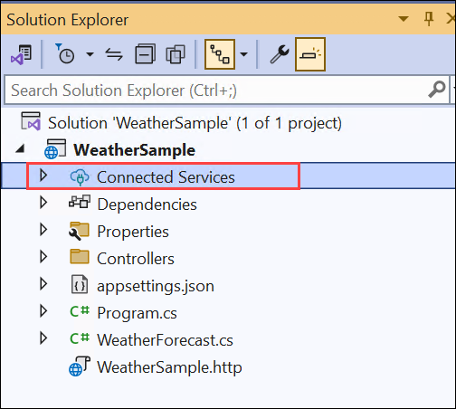
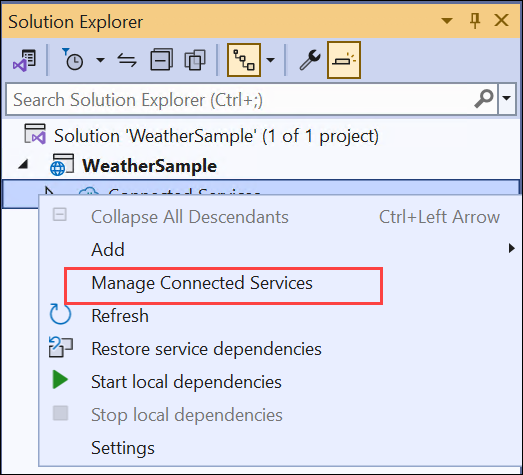
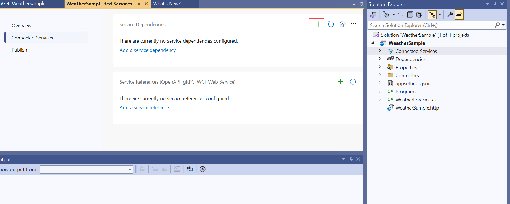
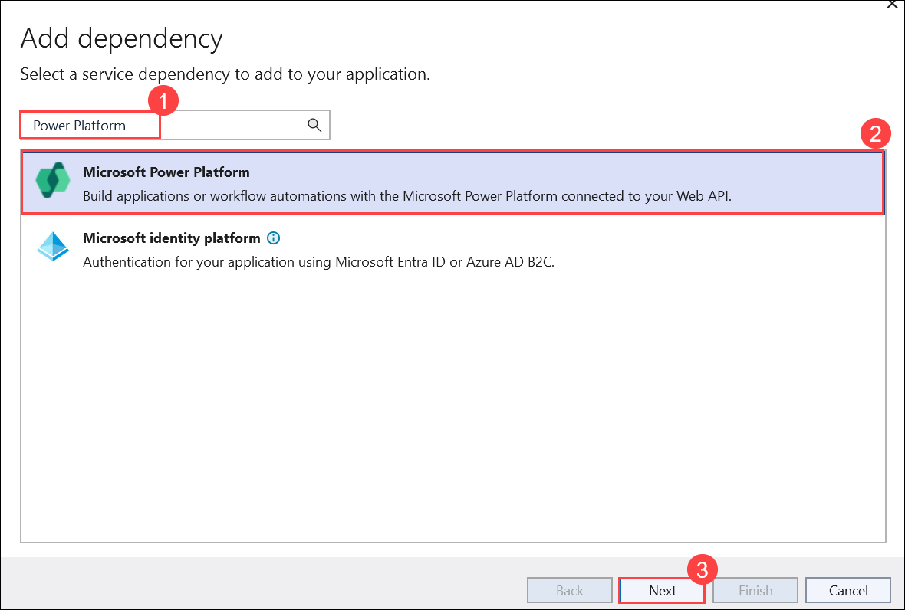
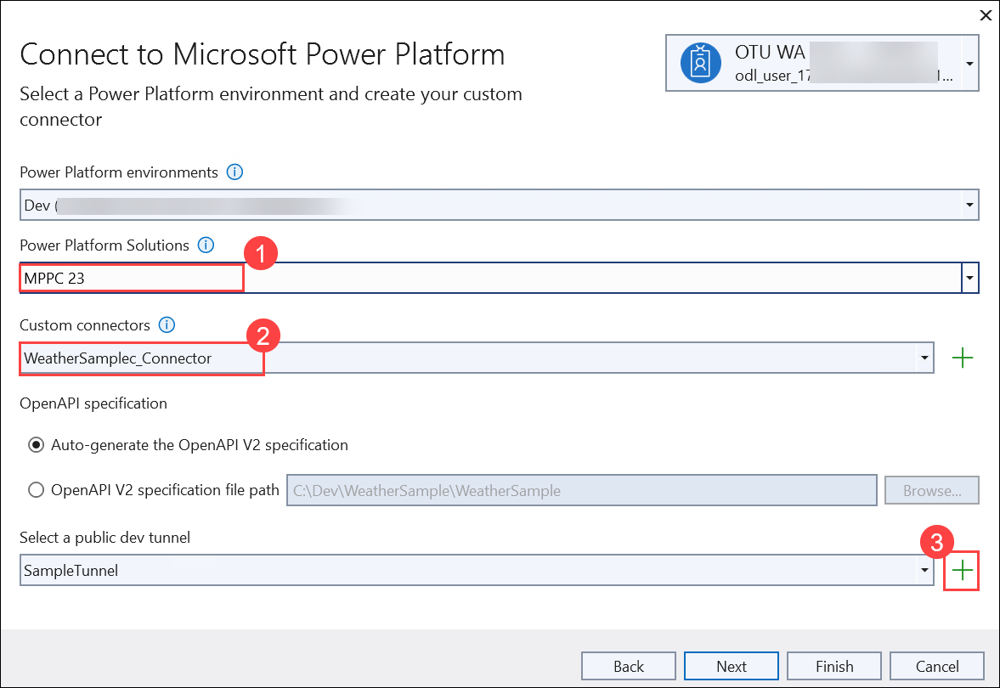
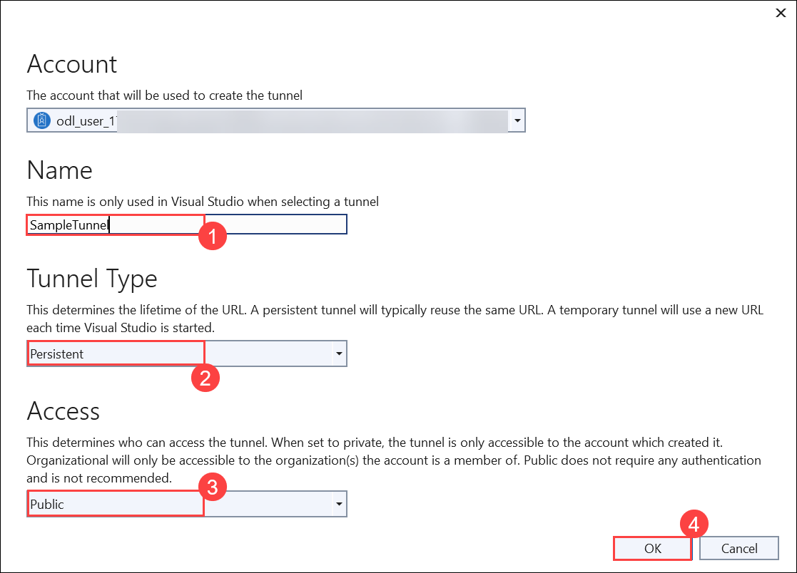
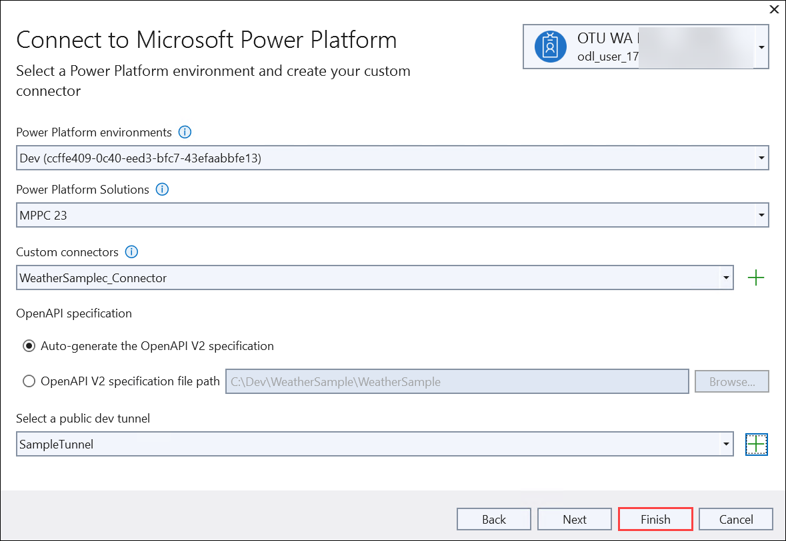
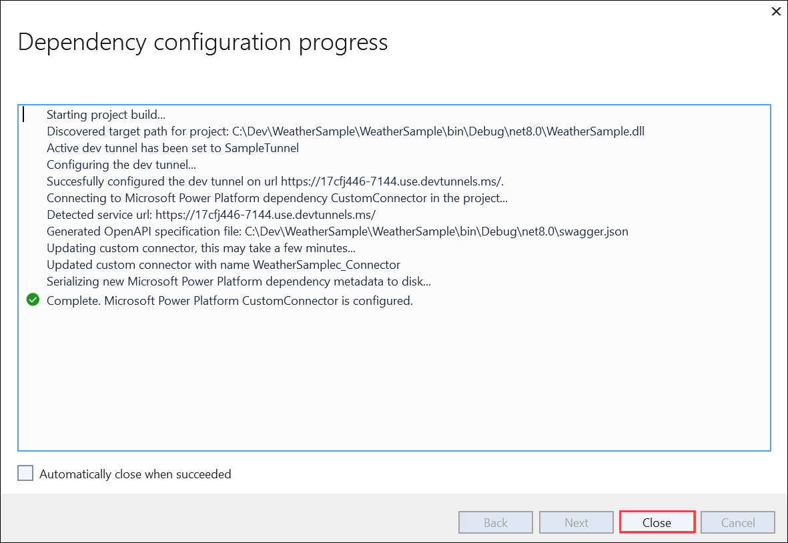
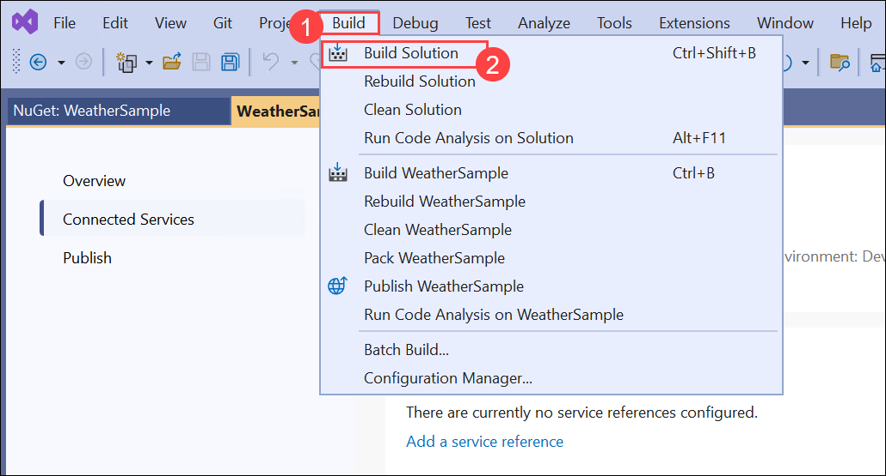

# 🚀 Lab 5: Connect your own WebAPI to your Power App

> **Note:** This lab is optional. Only do this one when you are finished with lab 1 - lab 4.


### Estimated Duration: 75 minutes

## Lab Scenario

You are a developer at Contoso Ltd exploring ways to extend the capabilities of Power Apps by integrating external services. Your team wants to connect custom backend APIs to Power Platform solutions to expose complex business logic and data that cannot be handled directly within Dataverse. In this optional lab, you will build a simple ASP.NET Core Web API using Visual Studio, register it as a custom connector through a dev tunnel, and consume it in a canvas app. This scenario mimics real-world enterprise integration patterns where external APIs are connected securely to low-code applications.

## Lab Objectives

In this lab, you will go though the following tasks:

- Task 1: Create an ASP.NET project in Visual Studio
- Task 2: Add Power Platform as a connected service
- Task 3: Create a canvas app with the custom connector

## ☑️ Task 1: Create an ASP.NET project in Visual Studio

In this task, we will create an ASP.NET project in Visual Studio.

1. Search for **Visual Studio 2022 (1)** and then select **Visual Studio 2022 (2)**.

    

1. Select **Create a new project**.

    

1. Search for `ASP.NET Core Web API` **(1)**, select `ASP.NET Core Web API` **(2)** the one that has **C# (3)** in the tags and select **Next (4)**.

    

1. Enter the following details and select **Next (3)**:

   - Enter `WeatherSample` for the Project name **(1)**

   - Enter `C:\Dev` for the Location **(2)**

        

1. In the next screen, select **Create**.

    

1. This should create your ASP.NET Code Web API project and open it in Visual Studio 2022.

    

1. Navigate to **Tools (1)** from the top menu and then select **Options (2)**.

    

1. Scroll down, then expand **Nuget Package Manager (1)** then select **Package Sources (2)** and make sure `nuget.org` package is added **(3)**. If present click on **Cancel (4)**.

    

    >**Note**: Please follow the below steps if `nuget.org` package is not added

    - Click on the **+** symbol to add the package

      

    - Provide the **Name** as `nuget.org` **(1)** then **Source** as `https://api.nuget.org/v3/index.json` **(2)** then click on **Update (3)** and then **OK (4)**

          

1. From the **Solution Explorer**, right click on the **WeatherSample** project.

    

1. Select **Manage NuGet Packages**.

    

1. Select **Installed (1)** tab, then make sure that `Swashbuckle.AspNetCore` is installed **(2)**.

    
   
   - If not, navigate to **Browse** tab

       

   - Search for `Swashbuckle.AspNetCore`, then click on **Install**    

   - Make sure `Swashbuckle.AspNetCore` is installed

## ☑️ Task 2: Add Power Platform as a connected service

In this task, you will add the Connected Service for Power Platform to your ASP.NET Code Web API project.

1. In **Solution Explorer**, right-click the **Connected Services** node.

    

1. Select **Manage Connected Services** from the context menu.

    

1. In the **Connected Services** tab, select the **+** icon for **Service Dependencies**.

    

1. On the **Add dependency** dialog, type `Power Platform` into the search box then select **Microsoft Power Platform (2)** and then **Next (3)**.

    

     >**Note**: If you aren't signed in already, sign into your Microsoft Power Platform account. If you don't have a Power Platform account, [Create a Developer Environment](create-developer-environment.md).

1. In the **Connect to Microsoft Power Platform** screen

   - Select your developer environment
   - **Power Platform Solution**: Select **MPPC 23 (1)**
   - In **Custom connectors name**, the value `WeatherSample_Connector` should already be set **(2)**
   - In **Select a public dev tunnel**, select the **+ (3)** icon

       

1. On the **Account** page, provide the following details:      

   - In the field **Name**, type `SampleTunnel` **(1)**

   - Select **Tunnel Type**: **Persistent** **(2)**

   - Select **Access** : **public** **(3)**

   - Select **OK** **(4)**

         

1. Select **Finish**.

    

1. Once the connected service is configured, select **Close**.

    

1. Click on **Build (1)** and then **Build Solution (2)**.
 
    

## ☑️ Task 3: Create a canvas app with the custom connector

In this task, you will create a canvas app that connects to your ASP.NET Web API using the custom connector, and display data from the API using a gallery.

When Visual Studio runs a web app and a tunnel is active, the web browser opens to a tunnel URL instead of a localhost URL.

1. Run your Visual Studio solution and start debugging.

1. When the browser opens, a warning page opens with the first request sent to the tunnel URL. Select **Continue**.

1. With the web API running, open [Power Apps](https://make.powerapps.com) in a new browser tab.

1. Select your developer environment in the upper-right corner.

1. [Create a blank canvas app](https://learn.microsoft.com/power-apps/maker/canvas-apps/create-blank-app) with **Phone** as the format.

1. In the top menu, select **Add data**.

1. Search for and select the **WeatherSample_Connector**, and then select **Connect**. More information: [Add connections to your canvas app](https://learn.microsoft.com/power-apps/maker/canvas-apps/add-data-connection)

1. Insert a button and drag it to the bottom of the form.

1. Change the button **Text** to *Load Data*.

1. Enter the following formula in the button's **OnSelect** property:

   ```powerapps-dot
   ClearCollect(weatherCollection, WeatherSample_Connector.GetWeatherForecast())
   ```

1. Insert a [vertical gallery](https://learn.microsoft.com/power-apps/maker/canvas-apps/add-gallery)

1. Select the **weatherCollection** as the data source, and then change the layout to **Title and subtitle**.

1. Run the app. It should look like the following example:


## Review

In this lab you have completed the following tasks:

- Created an ASP.NET project in Visual Studio
- Added Power Platform as a connected service
- Created a canvas app with the custom connector


### Congratulations! you have successfully completed this lab.

