# 🚀 Lab 5: Connect your own WebAPI to your Power App

> **Note:**
> This lab is optional. Only do this one when you are finished with lab 1 - lab 4.

## 📝 Lab 5 - Tasks

In this lab, you will go though the following tasks:

- Create an ASP.NET project in Visual Studio
- Add Power Platform as a connected service
- Create a canvas app with the custom connector

### ☑️ Task 1: Create an ASP.NET project in Visual Studio

In this task, we will create an ASP.NET project in Visual Studio.

1. Search for **Visual Studio 2022 (1)** and then select **Visual Studio 2022 (2)**.

    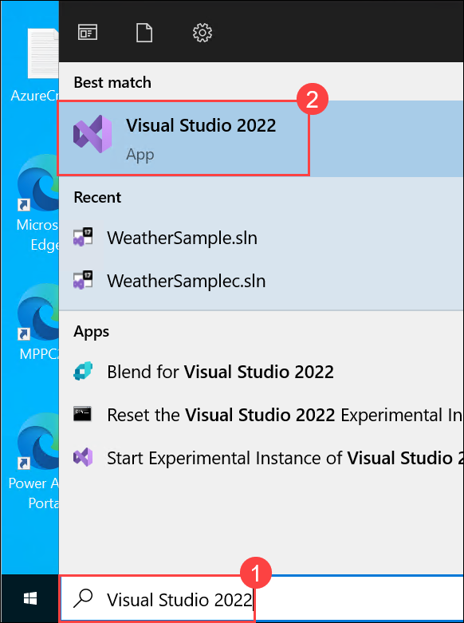

1. Select **Create a new project**.

    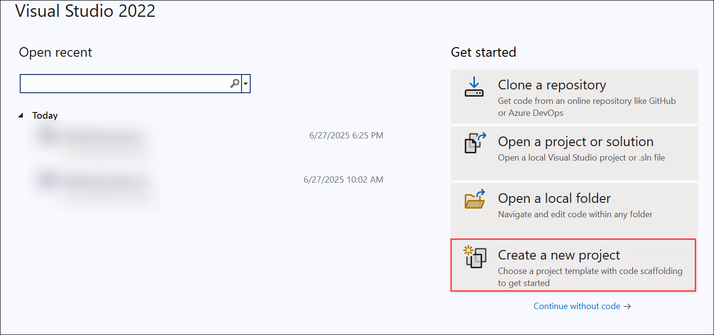

1. Search for `ASP.NET Core Web API` **(1)**, select `ASP.NET Core Web API` **(2)** the one that has **C# (3)** in the tags and select **Next (4)**.

    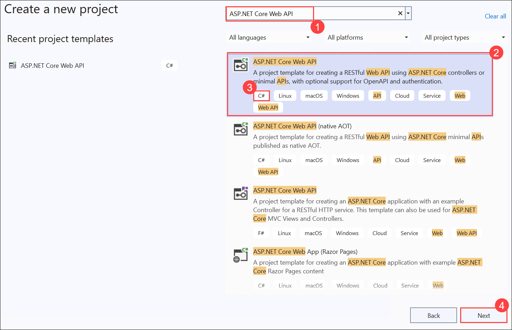

1. Enter the following details and select **Next (3)**:

   - Enter `WeatherSample` for the Project name **(1)**

   - Enter `C:\Dev` for the Location **(2)**

     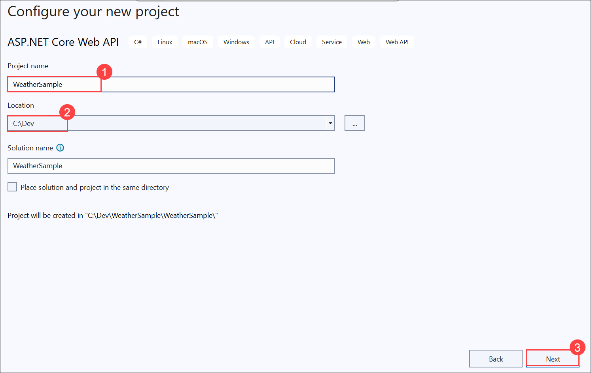   

1. In the next screen, select **Create**.

    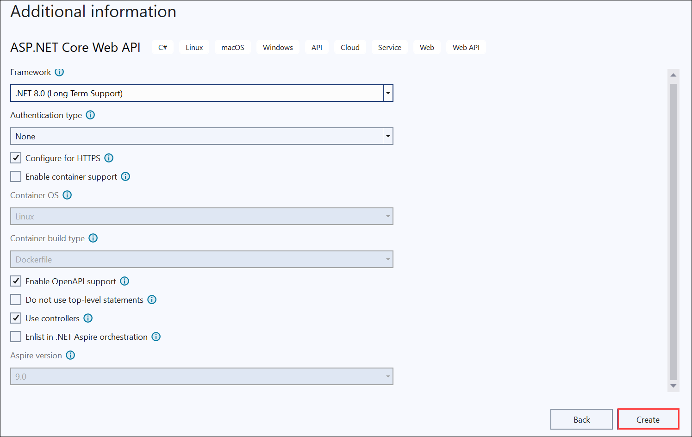

1. This should create your ASP.NET Code Web API project and open it in Visual Studio 2022.

    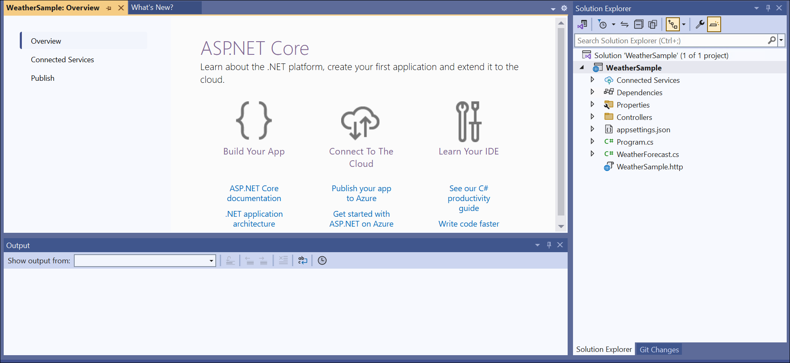

1. Navigate to **Tools (1)** from the top menu and then select **Options (2)**.

    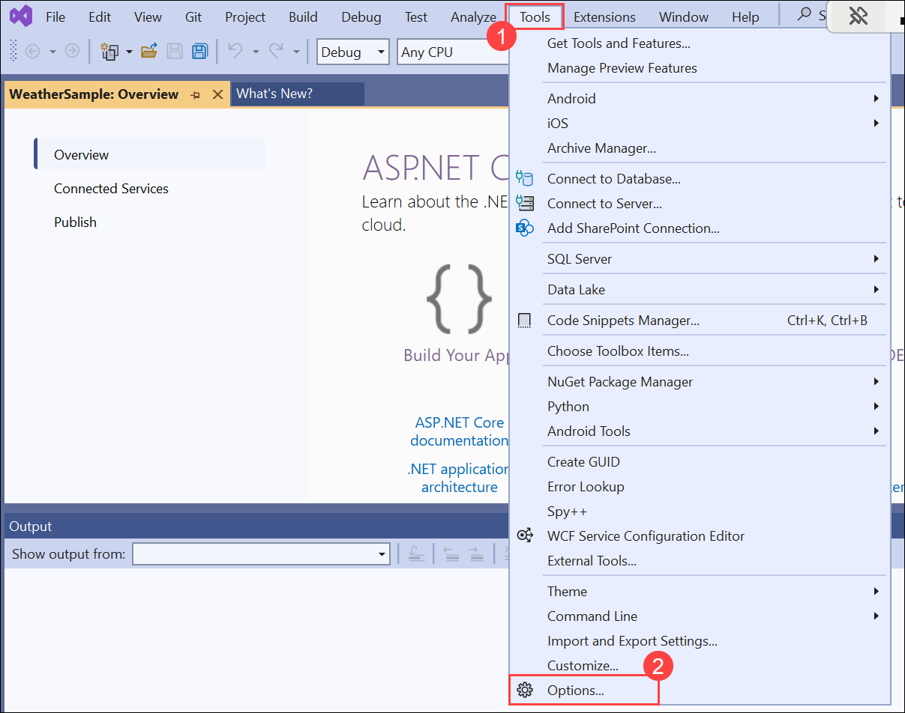

1. Scroll down, then expand **Nuget Package Manager (1)** then select **Package Sources (2)** and make sure `nuget.org` package is added **(3)**. If present click on **Cancel (4)**.

    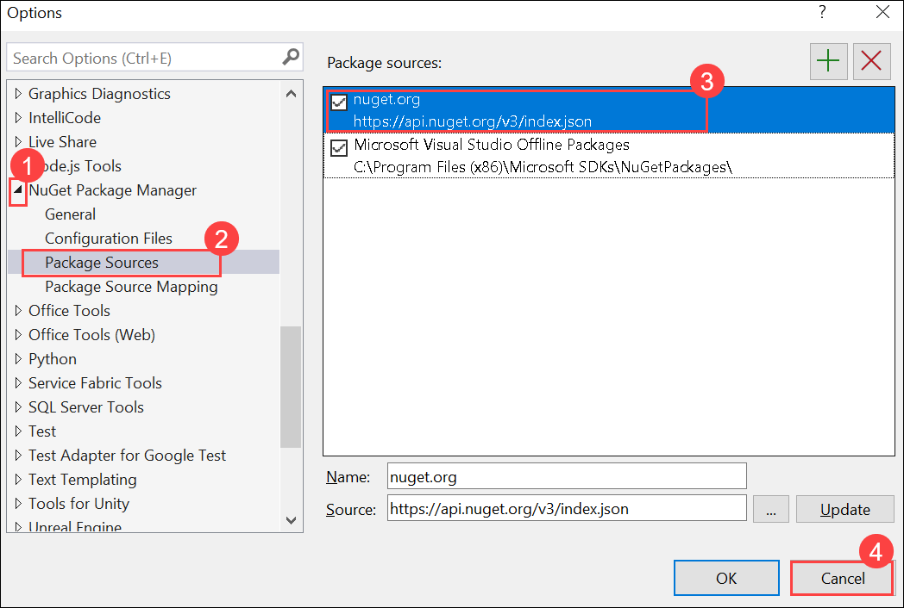

    >**Note**: Please follow the below steps if `nuget.org` package is not added

    - Click on the **+** symbol to add the package

      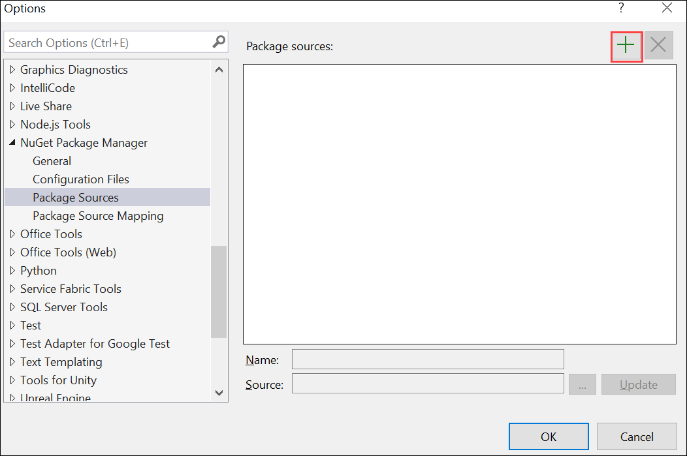

    - Provide the **Name** as `nuget.org` **(1)** then **Source** as `https://api.nuget.org/v3/index.json` **(2)** then click on **Update (3)** and then **OK (4)**

      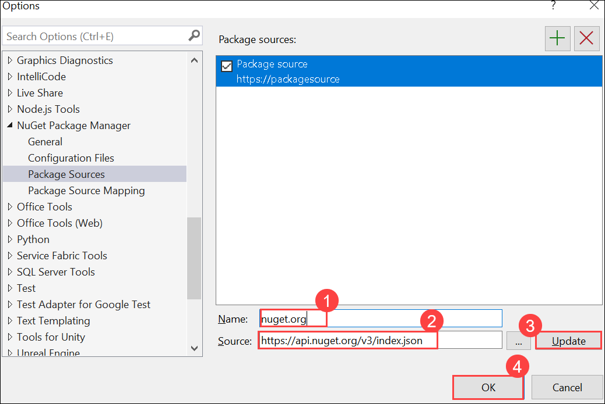    

1. From the **Solution Explorer**, right click on the **WeatherSample** project.

    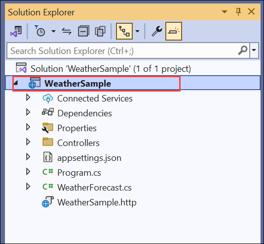

1. Select **Manage NuGet Packages**.

    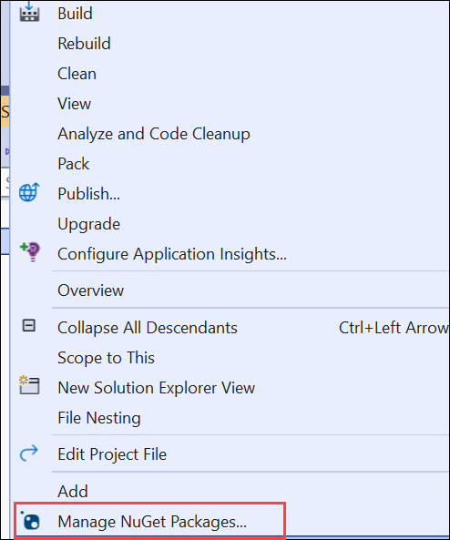

1. Select **Installed (1)** tab, then make sure that `Swashbuckle.AspNetCore` is installed **(2)**.

    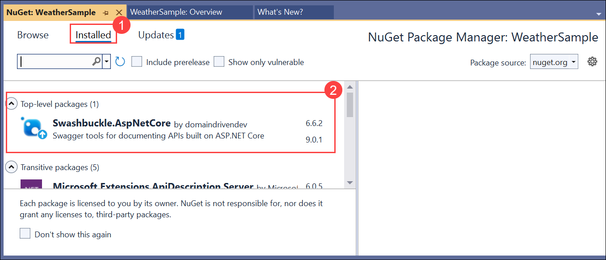
   
   - If not, navigate to **Browse** tab

     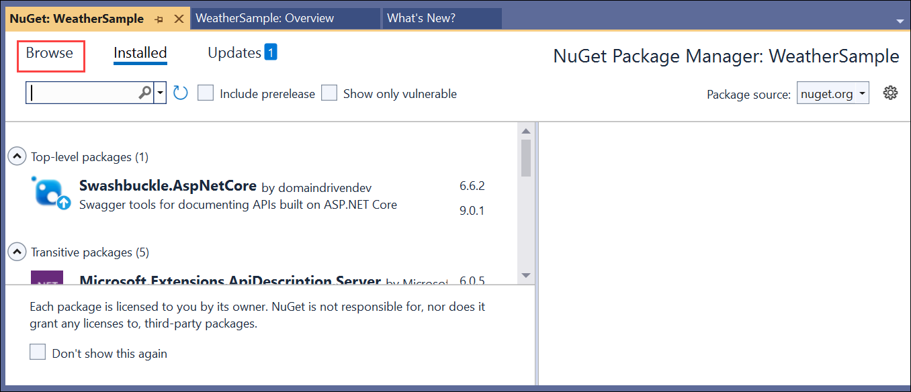  

   - Search for `Swashbuckle.AspNetCore`, then click on **Install**    

   - Make sure `Swashbuckle.AspNetCore` is installed

### ☑️ Task 2: Add Power Platform as a connected service

In this task, you will add the Connected Service for Power Platform to your ASP.NET Code Web API project.


1. In **Solution Explorer**, right-click the **Connected Services** node and select **Manage Connected Services** from the context menu.

1. In the **Connected Services** tab, select the **+** icon for **Service Dependencies**.

1. On the **Add dependency** dialog, type `Power Platform` into the search box.

1. Select **Microsoft Power Platform**, and then select **Next**.

   If you aren't signed in already, sign into your Microsoft Power Platform account. If you don't have a Power Platform account, [Create a Developer Environment](create-developer-environment.md).

1. In the **Connect to Microsoft Power Platform** screen: select your developer environment.

1. In **Custom connectors name**, the value `WeatherSample_Connector` should already be set.

1. In **Select a public dev tunnel**, select the **+** icon.

   1. In the field **Name**, type `SampleTunnel`.

   1. Select **Tunnel Type**: **Persistent**.

   1. Select **Access** : **public**.

   1. Select **OK**.

1. Select **Finish**

1. Once the connected service is configured, select **Close**.

> **Note:** If you encounter an error stating that the `Swashbuckle.AspNetCore` package is not found, you may need to install it manually. Follow the steps below:
>
> - In **Solution Explorer**, right-click on the project (not the solution) you have created.
> - Select **"Open in Terminal"**.
> - Run the following command in the terminal:
>   ```
>   Install-Package Swashbuckle.AspNetCore
>   ```
> - If prompted, type **A** to accept all license agreements.
> - Once installed, try the previous steps again.


## ☑️ Task 3: Create a canvas app with the custom connector

When Visual Studio runs a web app and a tunnel is active, the web browser opens to a tunnel URL instead of a localhost URL.

1. Run your Visual Studio solution and start debugging.

1. When the browser opens, a warning page opens with the first request sent to the tunnel URL. Select **Continue**.

1. With the web API running, open [Power Apps](https://make.powerapps.com) in a new browser tab.

1. Select your developer environment in the upper-right corner.

1. [Create a blank canvas app](https://learn.microsoft.com/power-apps/maker/canvas-apps/create-blank-app) with **Phone** as the format.

1. In the top menu, select **Add data**.

1. Search for and select the **WeatherSample_Connector**, and then select **Connect**. More information: [Add connections to your canvas app](https://learn.microsoft.com/power-apps/maker/canvas-apps/add-data-connection)

1. Insert a button and drag it to the bottom of the form.

1. Change the button **Text** to *Load Data*.

1. Enter the following formula in the button's **OnSelect** property:

   ```powerapps-dot
   ClearCollect(weatherCollection, WeatherSample_Connector.GetWeatherForecast())
   ```

1. Insert a [vertical gallery](https://learn.microsoft.com/power-apps/maker/canvas-apps/add-gallery)

1. Select the **weatherCollection** as the data source, and then change the layout to **Title and subtitle**.

1. Run the app. It should look like the following example:


## End of labs

This is the end of the optional lab 5 and the workshop, select the link below to move back to the workshop readme.
